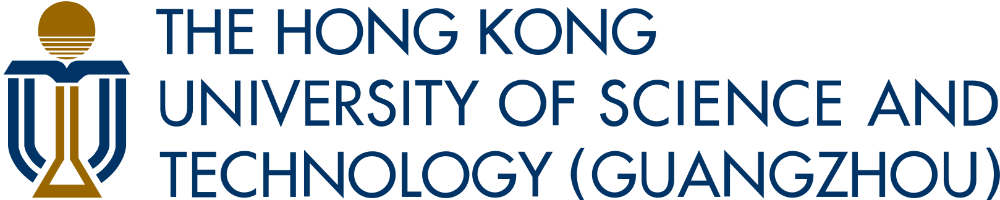

<p align="center">
  
</p>

<h1 align="center">What Limits Vision-and-Language Navigation?</h1>

<p align="center">
  <a href="">Yunheng Wang</a><sup>1</sup> ·
  <a href="">Yuetong Fang</a><sup>1</sup> ·
  <a href="">Taowen Wang</a><sup>1</sup> ·
  <a href="">Lusong Li</a><sup>2</sup> ·
  <a href="">Kun Liu</a><sup>2</sup> ·
  <a href="">Junzhe Xu</a><sup>1,2</sup>
  <br/>
  <a href="">Zizhao Yuan</a><sup>1</sup> ·
  <a href="">Yixiao Feng</a><sup>1</sup> ·
  <a href="">Jiaxi Zhang</a><sup>1</sup> ·
  <a href="">Wei Lu</a><sup>1</sup>
  <br/>
  <a href="">Zecui Zeng</a><sup>2,†</sup> ·
  <a href="">Renjing Xu</a><sup>1,†</sup>
</p>

<p align="center"><strong>Under Review</strong></p>

<p align="center">
  <sup>1</sup>HKUST(GZ) · <sup>2</sup>JD Explore Academy
</p>

<p align="center">
  
  &nbsp;&nbsp;&nbsp;
  
</p>

<p align="center">
  <a href=""></a>
  <a href="https://yunheng-wang.github.io/stereonav-public.github.io/"></a>
  <a href="https://huggingface.co/datasets/YunhengWang/StereoNav_DataSet"></a>
  <a href="https://huggingface.co/YunhengWang/StereoNav_Model"></a>
  <a href="https://opensource.org/licenses/MIT"></a>
</p>

## Abstract

Vision-and-Language Navigation (VLN) is a cornerstone of embodied intelligence. However, current agents often suffer from significant performance degradation when transitioning from simulation to real-world deployment, primarily due to perceptual instability (e.g., lighting variations and motion blur) and under-specified instructions. While existing methods attempt to bridge this gap by scaling up model size and training data, we argue that the bottleneck lies in the lack of robust spatial grounding and cross-domain priors. In this paper, we propose StereoNav, a robust Vision-Language-Action framework designed to enhance real-world navigation consistency. To address the inherent gap between synthetic training and physical execution, we introduce Target-Location Priors as a persistent bridge. These priors provide stable visual guidance that remains invariant across domains, effectively grounding the agent even when instructions are vague. Furthermore, to mitigate visual disturbances like motion blur and illumination shifts, StereoNav leverages stereo vision to construct a unified representation of semantics and geometry, enabling precise action prediction through enhanced depth awareness. Extensive experiments on R2R-CE and RxR-CE demonstrate that StereoNav achieves state-of-the-art egocentric RGB performance, with SR and SPL scores of 81.1% and 68.3%, and 67.5% and 52.0%, respectively, while using significantly fewer parameters and less training data than prior scaling-based approaches. More importantly, real-world robotic deployments confirm that StereoNav substantially improves navigation reliability in complex, unstructured environments.

<p align="center">
  
</p>
<p align="center"><strong>Overview of StereoNav</strong></p>

## News

- 🔥 **[2026-05-09]** We release all code, model checkpoints, and datasets for StereoNav.

---

# 🛠️ Installation

## 1. Clone the Repository

```bash
git clone https://github.com/Yunheng-Wang/StereoNav.git
cd StereoNav
```

This project requires **two separate conda environments**: `stereonav_train` for training and inference, and `stereonav_test` for evaluation.

---

## 2. Training Environment (`stereonav_train`)

**Step 1 — Create the base environment:**
```bash
conda env create -f environment_train.yml
conda activate stereonav_train
```

**Step 2 — Install PyTorch** with the CUDA version matching your system. See [pytorch.org](https://pytorch.org/get-started/locally/) for the correct command. Example for CUDA 12.4:
```bash
pip install torch==2.6.0+cu124 torchaudio==2.6.0+cu124 torchvision==0.21.0+cu124 \
    --index-url https://download.pytorch.org/whl/cu124
```

**Step 3 — Install `flash-attn`:** Download the prebuilt wheel that matches your Python, PyTorch, and CUDA versions from the [flash-attention releases page](https://github.com/Dao-AILab/flash-attention/releases), then install it:
```bash
pip install flash_attn-*.whl
```

**Step 4 — Install `triton`** (version should match your PyTorch installation):
```bash
pip install triton
```

---

## 3. Evaluation Environment (`stereonav_test`)

**Step 1 — Create the environment and install `habitat-sim`:**
```bash
conda create -n stereonav_test python=3.9
conda activate stereonav_test
conda install habitat-sim==0.2.4 withbullet headless -c conda-forge -c aihabitat
```

**Step 2 — Install `habitat-lab` and `habitat-baselines`:**
```bash
git clone --branch v0.2.4 https://github.com/facebookresearch/habitat-lab.git
cd habitat-lab
pip install -e habitat-lab
pip install -e habitat-baselines
cd ..
```

**Step 3 — Install remaining dependencies:**
```bash
pip install -r requirements.txt
```

# 📦 Data Preparation

## Step 1: Download Scene Data

Download the **MP3D** scenes from [Matterport3D](https://niessner.github.io/Matterport/) and the **HM3D** scenes from [HM3D](https://github.com/matterport/habitat-matterport-3dresearch), then place them under `data/scene/`:

```
data/scene/
├── hm3d/
│   ├── 00000-kfPV7w3FaU5/
│   ├── 00001-UVdNNRcVyV1/
│   ├── 00864-QHhQZWdMpGJ/
│   │   ├── QHhQZWdMpGJ.basis.glb
│   │   └── QHhQZWdMpGJ.basis.navmesh
│   └── ...
└── mp3d/
    ├── 17DRP5sb8fy/
    ├── 1LXtFkjw3qL/
    ├── zsNo4HB9uLZ/
    │   ├── zsNo4HB9uLZ.glb
    │   ├── zsNo4HB9uLZ.house
    │   ├── zsNo4HB9uLZ.navmesh
    │   └── zsNo4HB9uLZ_semantic.ply
    └── ...
```

## Step 2: Download Model Checkpoints

Download all checkpoints from [HuggingFace](https://huggingface.co/anonymous-stereonav/StereoNav_Model) and place them under `checkpoints/`.

**Pre-trained backbone models** (required for training):

| Checkpoint | Description |
|---|---|
| `InternVL3_5-2B` | Base MLLM backbone |
| `dinov2_large` | 2D structural encoder |
| `edgenext_small` | Component required by FoundationStereo |
| `foundationstereo` | 3D geometry encoder (pre-trained) |

**StereoNav checkpoints** (our trained models, ready for evaluation or fine-tuning):

| Checkpoint | Description |
|---|---|
| `stereonav_stage1` | Stage 1 checkpoint — trained on R2R and RxR |
| `stereonav_stage2` | Stage 2 checkpoint — jointly trained on R2R, RxR, ScaleVLN, and DAgger |

## Step 3: Prepare Training Data

**Option 1: Generate from scratch**
```bash
bash data/gen_trajectory.sh
```
This generates Stage 1 data (R2R, RxR) and Stage 2 data (ScaleVLN).

**Option 2: Download pre-processed data (recommended)**

Download from [HuggingFace](https://huggingface.co/datasets/YunhengWang/StereoNav_DataSet) and place under `data/cache/`:

```
data/cache/
└── train/
    ├── R2R/                  
    │   ├── images/
    │   ├── annotations_*.json
    │   ├── summary.json
    │   ├── baseline.txt
    │   └── intrinsics.txt
    ├── RxR/
    ├── ScaleVLN/
    └── dagger/
        ├── R2R/
        ├── RxR/
        ├── baseline.txt
        └── intrinsics.txt
```

> **Note:** The `dagger/` data provided here was generated using our released checkpoints. We recommend generating your own DAgger data based on your Stage 1 checkpoint. See [Step 1: Collect DAgger Data](#step-1-collect-dagger-data).


# 🧪 Evaluation

All evaluations run in the `stereonav_test` environment. They communicate with a StereoNav inference server, which runs separately in the `stereonav_train` environment.

## Prerequisites: Start Inference Servers

The inference server runs the StereoNav model and responds to evaluation queries. All evaluation scripts communicate with it over HTTP.

Activate the training environment and start the server:
```bash
conda activate stereonav_train
```

1. Edit `scripts/server.sh`:
   - `CHECKPOINT_PATH`: path to your model checkpoint directory (e.g., `checkpoints/stereonav_stage2`)
   - `BASE_PORT`: starting port for server instances (default: `7200`)
   - `NUM_GPUS`: number of parallel server instances to launch (default: `8`)

2. Launch the servers:
   ```bash
   bash scripts/server.sh
   ```

Each instance listens on a separate port from `BASE_PORT` to `BASE_PORT + NUM_GPUS - 1`. Evaluation scripts distribute requests across all running instances.

---

## 1. Accuracy Evaluation (Exact Goal Points)

Evaluates standard navigation performance using precise ground-truth goal-point annotations. This is the primary benchmark setting reported in the paper.

**Environment:** `stereonav_test`

**Configuration** — edit `evaluation/accuracy_eval_p_exact.sh`:
| Parameter | Description |
|---|---|
| `DATASET` | Dataset to evaluate: `"r2r"` or `"rxr"` |
| `BASE_PORT` | Must match the port used when starting the inference server |
| `NUM_SERVERS` | Number of running server instances |

```bash
conda activate stereonav_test
bash evaluation/accuracy_eval_p_exact.sh
```

**Metrics:** Success Rate (SR), SPL, Oracle Success Rate, Navigation Error (NE), Trajectory Length (TL)

---

## 2. Accuracy Evaluation (Coarse Goal Points)

Evaluates robustness to goal-point localization errors by randomly sampling the goal point within a radius around the true target.

**Environment:** `stereonav_test`

**Configuration** — edit `evaluation/accuracy_eval_p_coarse.sh`:
| Parameter | Description |
|---|---|
| `DATASET` | Dataset to evaluate: `"r2r"` or `"rxr"` |
| `COARSE_RADIUS` | Sampling radius in meters around the true goal (e.g., `2.0` = ±2m error) |
| `BASE_PORT` | Must match the port used when starting the inference server |
| `NUM_SERVERS` | Number of running server instances |

```bash
conda activate stereonav_test
bash evaluation/accuracy_eval_p_coarse.sh
```

---

## 3. Robustness Evaluation

These evaluations test the agent's resilience to various visual and physical perturbations that commonly occur in real-world deployment. All four sub-evaluations use the `stereonav_test` environment.

### 3.1 Rotation Deviation

Simulates viewpoint perturbations caused by imprecise rotation execution or IMU drift, by randomly rotating the agent's heading at each step.

**Configuration** — edit `evaluation/robustness_eval_p_fix_deviation.sh`:
| Parameter | Description |
|---|---|
| `ROTATION_PERTURBATION` | Maximum random rotation applied per step in degrees (e.g., `30` = ±30° deviation) |
| `PERTURBATION_PROBABILITY` | Probability of applying the perturbation at each step. Range: `0.0` to `1.0` |
| `BASE_PORT` / `NUM_SERVERS` | Must match running inference servers |

```bash
conda activate stereonav_test
bash evaluation/robustness_eval_p_fix_deviation.sh
```

---

### 3.2 Motion Blur

Simulates motion blur caused by fast camera movement or robot vibration, by applying a blur kernel to input frames.

**Configuration** — edit `evaluation/robustness_eval_p_fix_blur.sh`:
| Parameter | Description |
|---|---|
| `MOTION_BLUR_STRENGTH` | Blur intensity. `0.0` = no blur; higher values = stronger blur (e.g., `1.0` = strong blur) |
| `BASE_PORT` / `NUM_SERVERS` | Must match running inference servers |

```bash
conda activate stereonav_test
bash evaluation/robustness_eval_p_fix_blur.sh
```

---

### 3.3 Lighting Perturbation

Simulates lighting condition changes (e.g., overexposure, underexposure) by applying a global brightness offset to all input frames.

**Configuration** — edit `evaluation/robustness_eval_p_perturbation.sh`:
| Parameter | Description |
|---|---|
| `LIGHT_PERTURBATION` | Brightness offset applied to each frame. `0.0` = no change; positive = brighter (e.g., `0.8`); negative = darker (e.g., `-0.5`). Range: `-1.0` to `1.0` |
| `BASE_PORT` / `NUM_SERVERS` | Must match running inference servers |

```bash
conda activate stereonav_test
bash evaluation/robustness_eval_p_perturbation.sh
```

---

### 3.4 Camera Height Fluctuation

Simulates vertical camera displacement caused by uneven terrain or robot body oscillation during locomotion.

**Configuration** — edit `evaluation/robustness_eval_p_fluctuation.sh`:
| Parameter | Description |
|---|---|
| `HEIGHT_OFFSET` | Vertical displacement in meters relative to the default camera height (1.25m). Positive = higher (e.g., `0.6`); negative = lower (e.g., `-0.6`) |
| `BASE_PORT` / `NUM_SERVERS` | Must match running inference servers |

```bash
conda activate stereonav_test
bash evaluation/robustness_eval_p_fluctuation.sh
```

---

## 4. Instruction Ambiguity Analysis (Optional)

Analyzes the degree of ambiguity in navigation instructions using a VLM judge. This produces per-episode ambiguity scores that can be used to study the correlation between instruction clarity and navigation performance.

**Environment:** `stereonav_test`

### Step 1: Generate Trajectory Data

Generate ground-truth trajectory frames for the R2R-CE unseen validation set:
```bash
conda activate stereonav_test
bash evaluation/cache/gen_data.sh
```
Output is saved to `evaluation/cache/result_r2r_*/`.

### Step 2: Run VLM Evaluation

Configure and run the VLM judge:

```bash
export OPENAI_API_KEY="your-api-key"
```

Edit `evaluation/pilot_eval_instruction_ambiguity.sh`:
| Parameter | Description |
|---|---|
| `MODEL` | VLM model to use as judge (e.g., `gpt-4o`, `claude-opus-4-7`, `gemini-2.5-pro`) |
| `BASE_URL` | (Optional) Custom API endpoint for the VLM |

```bash
bash evaluation/pilot_eval_instruction_ambiguity.sh
```

**Output:** JSONL files with per-episode directional and docking ambiguity scores.

---


# 🚀 Training

StereoNav uses a two-stage training pipeline. Stage 1 trains on standard VLN datasets (R2R, RxR), and Stage 2 fine-tunes with DAgger-collected data and ScaleVLN for improved generalization.

## Prerequisites

Before training, complete [Step 2 (Checkpoints)](#step-2-download-model-checkpoints) and [Step 3 (Training Data)](#step-3-prepare-training-data) from the Data Preparation section above.

**Required checkpoints** (place under `checkpoints/`):
- `InternVL3_5-2B` — base MLLM backbone
- `dinov2_large` — 2D structural encoder
- `edgenext_small` — component required by FoundationStereo
- `foundationstereo` — 3D geometry encoder

**Required training data** (place under `data/cache/train/`):
- `R2R/`, `RxR/` — for Stage 1
- `R2R/`, `RxR/`, `ScaleVLN/`, `dagger/` — for Stage 2

---

## Stage 1 Training

Stage 1 trains on R2R and RxR datasets. Training configuration is in `train_stage1.yaml`.

**Requirements:** 8 GPUs, ~100 GB VRAM total (bf16 mixed precision).

Activate the training environment, then run:
```bash
conda activate stereonav_train
CUDA_VISIBLE_DEVICES=0,1,2,3,4,5,6,7 accelerate launch \
    --multi_gpu --num_processes 8 --num_machines 1 \
    --mixed_precision bf16 --main_process_port 29555 \
    --dynamo_backend no train_stage1.py
```

Checkpoints and logs are saved to `log/`.

---

## Stage 2 Training

Stage 2 jointly trains on R2R, RxR, ScaleVLN, and DAgger data. It requires first collecting DAgger trajectories using your Stage 1 checkpoint.

### Step 1: Collect DAgger Data

DAgger data is collected by running the Stage 1 model in the simulator and recording corrected trajectories for R2R and RxR. This step requires **two separate terminals**.

**Terminal 1** — Start the inference server (using the `stereonav_train` environment):
```bash
conda activate stereonav_train
```
1. Edit `scripts/server.sh`:
   - Set `CHECKPOINT_PATH` to your Stage 1 checkpoint directory
   - Set `BASE_PORT` (default: `7200`) and `NUM_GPUS` (default: `8`)

2. Start the inference servers:
   ```bash
   bash scripts/server.sh
   ```

**Terminal 2** — Collect DAgger trajectories (using the `stereonav_test` environment):
```bash
conda activate stereonav_test
```
3. Ensure `BASE_PORT` and `NUM_GPUS` in `data/dagger.sh` match the running servers, then run:
   ```bash
   bash data/dagger.sh
   ```

Output is saved to `data/cache/train/dagger/`.

### Step 2: Train Stage 2

Stage 2 jointly trains on all datasets. Training configuration is in `train_stage2.yaml`.

**Requirements:** 8 GPUs, ~100 GB VRAM total (bf16 mixed precision).

1. Edit `train_stage2.yaml`:
   - Set `resume_checkpoint` to your Stage 1 checkpoint path

2. Activate the training environment and run:
   ```bash
   conda activate stereonav_train
   CUDA_VISIBLE_DEVICES=0,1,2,3,4,5,6,7 accelerate launch \
       --multi_gpu --num_processes 8 --num_machines 1 \
       --mixed_precision bf16 --main_process_port 29555 \
       --dynamo_backend no train_stage2.py
   ```

Checkpoints and logs are saved to `log/`.


# 🤖 Real-World Deployment

StereoNav is deployed on a **Unitree G1** humanoid robot equipped with a **ZED Mini** stereo camera. Since G1 does not have a built-in stereo camera mount, we use the open-source [TWIST2 Build Neck](https://yanjieze.com/TWIST2/) fixture to attach the ZED Mini to the robot's head.

The deployment involves four components running across three machines:

| Component | Machine | Script |
|---|---|---|
| ZED camera server | G1 onboard computer | `real_world/zed/zed_realtime_server.py` |
| Robot action server | Laptop (connected to G1) | `real_world/action_server.py` |
| Navigation controller | Laptop (connected to G1) | `real_world/deployment.sh` |
| StereoNav inference server | Remote GPU server | `scripts/server.sh` |

---

## Step 1: Hardware Setup

1. Print and assemble the [TWIST2 Build Neck](https://yanjieze.com/TWIST2/) fixture.
2. Mount the ZED Mini camera onto the fixture and attach it to the G1 robot's head.
3. Connect the ZED Mini to the G1 onboard computer via USB.

---

## Step 2: Start the ZED Camera Server (on G1)

SSH into the G1 onboard computer (refer to the [G1 developer guide](https://support.unitree.com/home/en/G1_developer/about_G1)):
```bash
ssh unitree@192.168.123.161
```

Upload the ZED server files to the robot:
```bash
# Run this on your laptop
scp -r real_world/zed unitree@192.168.123.161:/home/unitree/
```

Then on the G1, start the camera server:
```bash
/usr/bin/python3 /home/unitree/zed/zed_realtime_server.py --network eth0
```

> `--network` should match the network interface connected to your laptop (e.g., `eth0`). A successful start prints `ZED opened successfully.`

---

## Step 3: Start the Robot Action Server (on Laptop)

Before starting, configure `real_world/action_config.json`:
```json
{
    "unitree_sdk_path": "/path/to/unitree_sdk2_python",
    "network": "eth0",
    "action_port": 8001,
    ...
}
```

Set `unitree_sdk_path` to the absolute path of your local `unitree_sdk2_python` directory, and `network` to the interface connected to G1.

Then start the action server:
```bash
cd real_world
python action_server.py
```

---

## Step 4: Start the Inference Server (on Remote GPU Server)

SSH into your GPU server and start the StereoNav inference server:

1. Edit `scripts/server.sh`:
   - Set `CHECKPOINT_PATH` to your model checkpoint directory (e.g., `checkpoints/stereonav_stage2`)
   - Set `BASE_PORT` (default: `7200`) and `NUM_GPUS` (default: `8`)

2. Launch the server:
   ```bash
   bash scripts/server.sh
   ```

3. Forward the inference server port to your laptop:
   ```bash
   # Run this on your laptop
   ssh -L 7203:127.0.0.1:7203 user@<gpu-server-ip>
   ```

---

## Step 5: Run Navigation (on Laptop)

Configure and run `real_world/deployment.sh`:

```bash
# Navigation instruction for the robot
USER_INSTRUCTION="Walk forward through the hallway, turn left at the end, ..."

# LLM API for instruction parsing
LLM_API_KEY="your-api-key"
LLM_BASE_URL="https://api.openai.com/v1"
LLM_MODEL="gpt-4o"

# Service endpoints
ZED_IP="192.168.123.161"     # G1 onboard computer IP
ACTION_URL="http://127.0.0.1:8001"   # action server
SERVER_URL="http://127.0.0.1:7203"   # inference server (port-forwarded)
```

Then launch:
```bash
bash real_world/deployment.sh
```

The controller will parse the instruction, fetch stereo frames from the ZED server, query the inference server for actions, and send them to the robot — repeating until a stop action is predicted or `MAX_STEPS` is reached.

---

## Acknowledgements

We thank the following open-source projects for their valuable contributions to this work:

- [StreamVLN](https://github.com/InternRobotics/StreamVLN)
- [JanusVLN](https://github.com/MIV-XJTU/JanusVLN)
- [NaVILA](https://github.com/AnjieCheng/NaVILA)
- [StereoVLA](https://github.com/shengliangd/StereoVLA)
- [TWIST2](https://github.com/amazon-far/TWIST2)
- [Unitree Robotics](https://github.com/unitreerobotics)
- [FoundationStereo](https://github.com/NVlabs/FoundationStereo)
- [InternVL](https://github.com/OpenGVLab/InternVL)
- [DINOv2](https://github.com/facebookresearch/dinov2)

---

## Citation

If you find this work useful, please consider citing:

```bibtex
@article{stereonav2026,
  title     = {What Limits Vision-and-Language Navigation?},
  author    = {Yunheng Wang and Yuetong Fang and Taowen Wang and Lusong Li and Kun Liu and Junzhe Xu and Zizhao Yuan and Yixiao Feng and Jiaxi Zhang and Wei Lu and Zecui Zeng and Renjing Xu},
  journal   = {arXiv preprint},
  year      = {2026},
}
```
